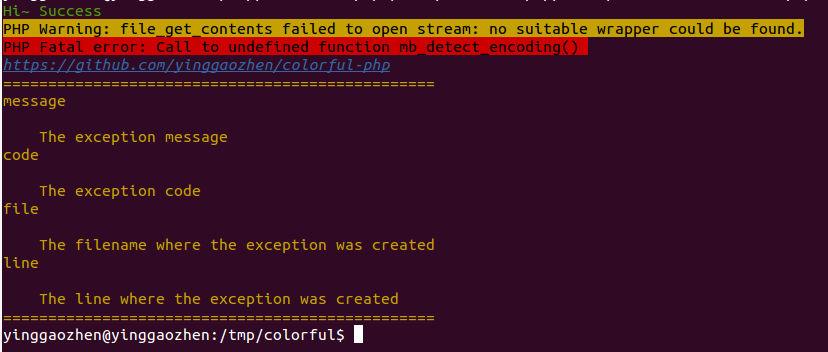

# Colorful-PHP

## Preface
在写[Nold文档示例生成小工具](https://github.com/yinggaozhen/nold)以及的时候，想要加入一个Console Helper类用于界面友好的命令行输出展示，其中需要对输出的文档进行适当美化。虽然这个东西并不复杂，但是考虑到这个可集成到目前自己所写绝大部分的工具或者框架(譬如现在正在写的Nold文档生成小工具以及Zaor)，所以便单独抽出来花了点时间写一下.

## Application
Let's console to be Colorful~:satisfied:

## Install
> composer require yinggaozhen/colorful-php dev-master

## Usage
> 大体用法是通过Cololrful::apply传入要渲染的文本以及主题，其中主题包括内置基础主题和装饰主题(可通过参数进一步调节).当然也可以通过Cololrful::import导入主题.

_ _ _
```php

// 基础主题
Colorful::apply('Hi~ Success', 'success');
Colorful::apply('PHP Warning: file_get_contents failed to open stream: no suitable wrapper could be found.', 'warn');
Colorful::apply('PHP Fatal error: Call to undefined function mb_detect_encoding() ', 'fatal');
Colorful::apply('https://github.com/yinggaozhen/colorful-php', 'hyperlink');

// 装饰主题
$longtext = "message\n\n    The exception message\ncode\n\n    The exception code\nfile\n\n    The filename where the exception was created\nline\n\n    The line where the exception was created";
$frame = new \colorful\decorator\Frame([
    'spec' => '',
    'decorate' => '='
]);
echo colorful\Colorful::apply($longtext, ['yellow', null, []], $frame) . PHP_EOL;
```
_ _ _


### Theme List
| Theme List | Type | Params |
|--------|--------|--------|
|  success      |    Base    |    /    |
|  warn      |    Base    |    /    |
|  fatal      |    Base    |    /    |
|  hyperlink  |    Base    |    /    |
|  frame      |    ```Decoretor```    |    ```php ['decorate' => 装饰符,默认*, 'spec' => 占位符,默认为'']```      |